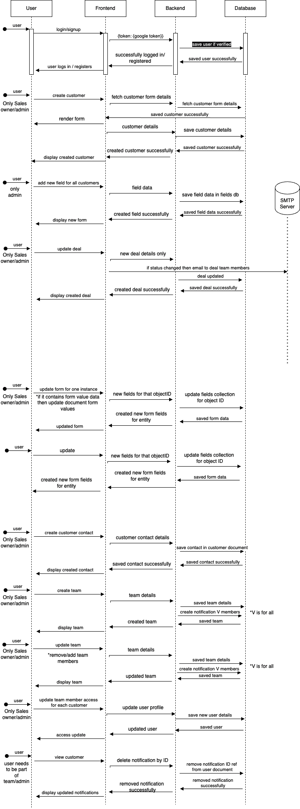

<p align="center">
    
    <br/>
    <br/>
    <b>Saleswiz: The CRM Solution for Streamlined Sales and Client Management, Customized to Your Needs.</b>
</p>

[](https://nodejs.org "Go to Node.js homepage")
[](https://reactjs.org "Go to React homepage")

[](https://github.com/apiwizlabs/saleswiz/issues)
[](https://github.com/apiwizlabs/saleswiz/stargazers)


[](https://twitter.com/getapiwiz)
[](https://www.linkedin.com/company/apiwizio/)

<!-- Add github shields badges  -->


[**APIwiz is proud to make Saleswiz public for Contributions**](https://www.apiwiz.io/)  
Saleswiz is the gateway to effortless deal management and well-organized client relationships, empowering Sales Executives within [APIwiz](https://www.apiwiz.io/)

🎉 Now its Open to empower 💪🏻 Sales Executives in your Organisation too

## 🤔 Why Saleswiz?
Saleswiz stands out with streamlined client management, effortless tracking, and efficient deal handling. Its customizability and role-based access control empower teams to adapt to their unique needs. With Saleswiz, you'll enhance productivity and never miss high-priority notifications, setting it apart from the competition.

## ✨ Features

- 🚀 Powerful web application designed for sales executives
- 📊 Streamlined client management
- 🎯 Effortless tracking of potential and existing clients
- 💼 Efficient deal management
- 📞 Organize contacts under each client
- 🧩 Customizable Role-Based Access Control (RBAC)
- 🛠️ Configure fields for each entity
- 🏆 Enhance sales productivity
- 💡 Tailor workflow to specific needs
- 📧 High-priority notifications delivered instantly to your mailbox

## 🚀 Getting Started
To getting started in local development environment, just fork the project git repository and follow the below steps:

Execue the shell script `setup.sh` to automatically setup for you or follow the below steps

```bash
  git clone https://github.com/<your_github_username>/saleswiz.git
  cd saleswiz
  npm install
  npm start
```

Navigate to `/public/config.js` and update the following variables accordingly
1. `PUBLIC_KEY` : This is a randomly generated rsa key used for encrypting passwords, you can get one yours from https://cryptotools.net/rsagen. Paste the Public key in this config and Private Key in the Backend config
2. `GOOGLE_OAUTH_CLIENT_ID`: This is a google oauth client id, you can get yours after [google oauth setup](https://support.google.com/cloud/answer/6158849?hl=en)
3. `API_BASE_URL`: The Base Url where your local server should be running
4. `BASE_URL`: The Base Url for your local UI server


Make sure the [Server side code](./Server/) is also setup, before running `npm start`

The above should setup the UI and server side development environment, and you can see your app running on `http://localhost:4000/`


## Architecture




## Community Support

For general help using Saleswiz, refer to the below discussion
- [Github](https://github.com/apiwizlabs/saleswiz-v2/discussions) - For bug reports, help, feature requests


## Contributing
All code contributions, including those of people having commit access, must go through a pull request and be approved by a maintaner before being merged. This is to ensure a proper review of all the code.

Kindly read our [Contributing Guide](./CONTRIBUTING.md) to familiarize yourself with Saleswiz's development process, how to suggest bug fixes and improvements, and the steps for building and testing your changes.

## Security

For security issues, kindly email us at security@apiwiz.com instead of posting a public issue on Github

## Follow Us
Join our growing community! Checkout out our official [Blog](https://www.apiwiz.io/resources/blogs). Follow us on [Twitter](https://twitter.com/getapiwiz), [Linkedin](https://www.linkedin.com/company/apiwizio/)


## Thanks to all Contributors 🙏🏼
<a href="https://github.com/apiwizlabs/saleswiz/graphs/contributors">
  
<a>

<!-- The above picture will be visible once made public -->


