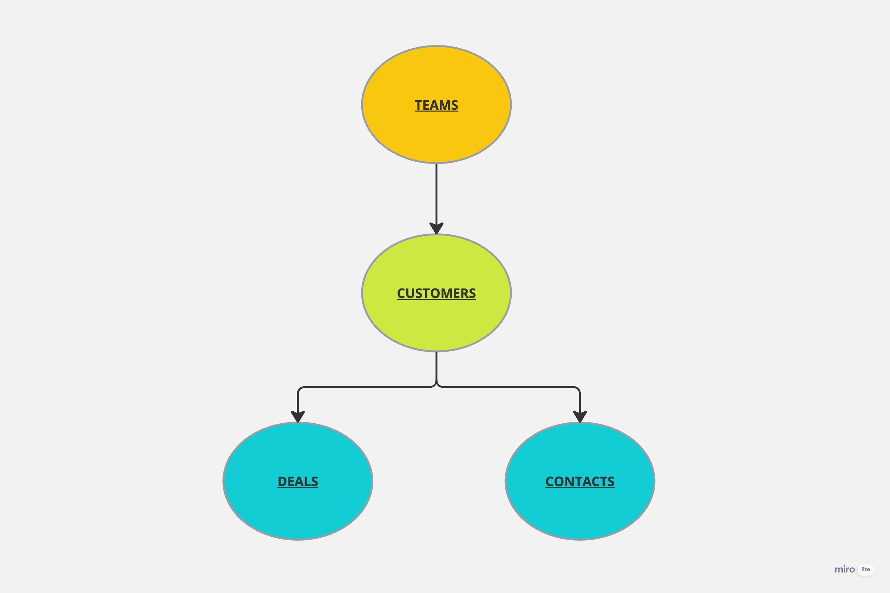
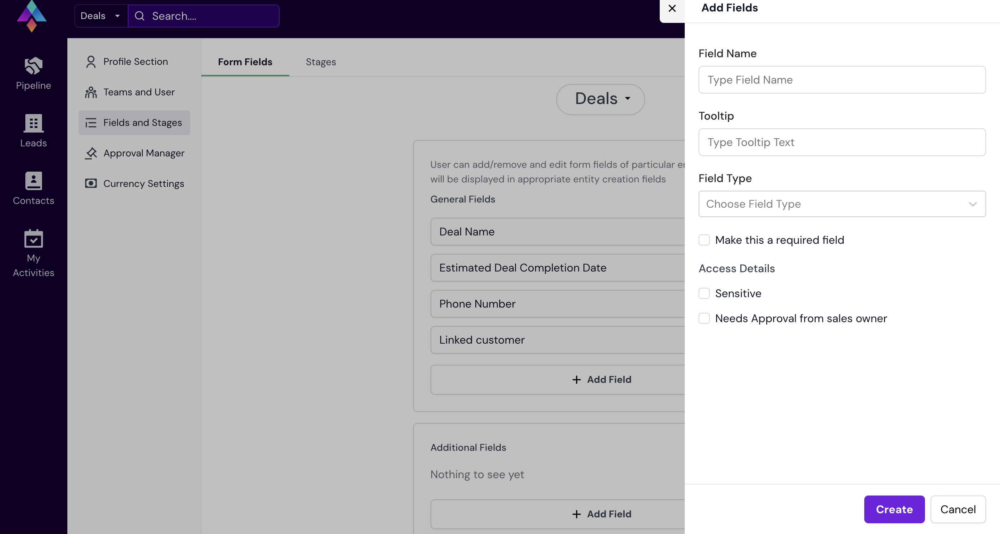
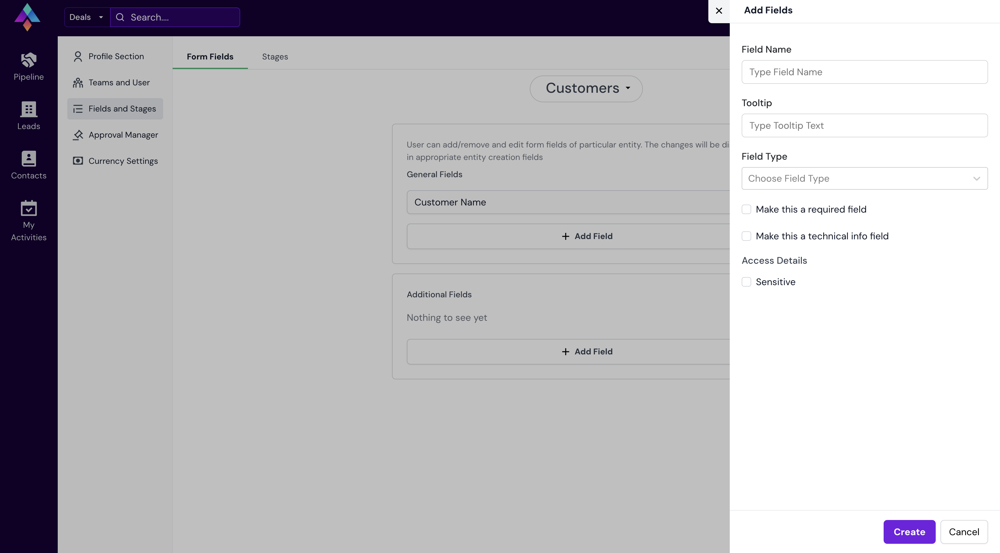

<p align="center">
    
    <br/>
    <br/>
    <b>Saleswiz: The CRM Solution for Streamlined Sales and Client Management, Customized to Your Needs.</b>
</p>

[](https://nodejs.org "Go to Node.js homepage")
[](https://reactjs.org "Go to React homepage")

[](https://github.com/apiwizlabs/saleswiz/issues)
[](https://github.com/apiwizlabs/saleswiz/stargazers)


[](https://twitter.com/getapiwiz)
[](https://www.linkedin.com/company/apiwizio/)

<!-- Add github shields badges  -->


[**APIwiz is proud to make Saleswiz public for Contributions**](https://www.apiwiz.io/)  
Saleswiz is the gateway to effortless deal management and well-organized client relationships, empowering Sales Executives within [APIwiz](https://www.apiwiz.io/)

🎉 Now its Open to empower 💪🏻 Sales Executives in your Organisation too

## 🤔 Why Saleswiz?
Saleswiz stands out with streamlined client management, effortless tracking, and efficient deal handling. Its customizability and role-based access control empower teams to adapt to their unique needs. With Saleswiz, you'll enhance productivity and never miss high-priority notifications, setting it apart from the competition.

## ✨ Features

- 🚀 Powerful web application designed for sales executives
- 📊 Streamlined client management
- 🎯 Effortless tracking of potential and existing clients
- 💼 Efficient deal management
- 📞 Organize contacts under each client
- 🧩 Customizable Role-Based Access Control (RBAC)
- 🛠️ Configure fields for each entity
- 🏆 Enhance sales productivity
- 💡 Tailor workflow to specific needs
- 📧 High-priority notifications delivered instantly to your mailbox

## 🚀 Getting Started
To getting started in local development environment, just fork the project git repository and follow the below steps:

Execue the shell script `setup.sh` to automatically setup for you or follow the below steps

```bash
  git clone https://github.com/<your_github_username>/saleswiz.git
  cd saleswiz
  npm install
  npm start
```

Navigate to `/public/config.js` and update the following variables accordingly
1. `PUBLIC_KEY` : This is a randomly generated rsa key used for encrypting passwords, you can get one yours from https://cryptotools.net/rsagen. Paste the Public key in this config and Private Key in the Backend config
2. `GOOGLE_OAUTH_CLIENT_ID`: This is a google oauth client id, you can get yours after [google oauth setup](https://support.google.com/cloud/answer/6158849?hl=en)
3. `API_BASE_URL`: The Base Url where your local server should be running
4. `BASE_URL`: The Base Url for your local UI server


Make sure the [Server side code](./Server/) is also setup, before running `npm start`

The above should setup the UI and server side development environment, and you can see your app running on `http://localhost:4000/`


## Sequence Diagram


## How does Saleswiz work?

### The User Role Types
1. Admin and Organisation Owner - a managerial role with no edit/read access restrictions
3. Sales Owner - Team Lead Role
4. Account Owner - Active Team Participant 
5. Engineering, Pre Sales and Marketing - Can only read data

### There are Four major entities:
1. Teams - consists of sales owner/s, account owner/s and other members that have an engineering/pre sales/marketing role.
2. Customers (or) Leads - Customer is the parent entity for deals and contacts i.e each deal or contact made needs to be linked to a customer
Note: Each Customer is linked to a team.
3. Deals - a deal made with a customer, consists of notes, activities and file uploads
4. Contacts - save the details of the people you need.

### High level Entity Relationship diagram:




### RBAC Control Rules:

1. Admins and Organisation Owners have no restrictions whatsoever.
2. Only if a user is part of a team will they be able to view entities within it. entities within a team include customers hence including deals and contacts as well.
3. Sales Owner can create teams but they would have to be the sales owner of that team (check?)
4. Engineering, Pre Sales and Marketing can edit/create and delete anything within a deal.
5. A user needsto either be the activity owner or the assignee to be able to update it.


### How to setup your data and perform certain actions:

make sure to login to an admin account for the following actions
1. Invite Some Email Ids to your workspace.
2. Create a Team 
   - go to settings via the wheel icon on the navbar then click on the "Create Team" button.
3. If you want to configure your form for deals, customers and contacts go to the "Fields and Stages" tab from the sidebar and configure it. 
4. Create a Customer/Lead by going to the Leads page from the sidebar in the left hand side. make sure to create a team beforehand and link it.
5. Create a Deal and a Contact by going to the Pipeline/Contacts Page respectively.
6. To Create an Activity, click on the deal card that's displayed in the pipeline page. then go to the Activity tab and create a Call/Task.
While creating a Call you can link a pre exisitng Contact to it.


### Form Configuration Explainer:

1. Needs For Approval Field: <br />
- The Needs For Approval Checkbox option that you see while configuring a field for a deal is used when you want to make sure a certain data point is approved before displaying it to everyone in the team.
Usually used to display the contract value of a deal publicly only after its "approved" by the sales owner. <br />
- The sales owner can find pending approval requests and history in the "Approval Manager" secion present in the sidebar of the settings page.




2. Make this a Technical Info Field: <br />
- the fields marked as technical info will be displayed in a different tab within the "Create Customer" modal.




## Community Support

For general help using Saleswiz, refer to the below discussion
- [Github](https://github.com/apiwizlabs/saleswiz/discussions) - For bug reports, help, feature requests


## Contributing
All code contributions, including those of people having commit access, must go through a pull request and be approved by a maintaner before being merged. This is to ensure a proper review of all the code.

Kindly read our [Contributing Guide](./CONTRIBUTING.md) to familiarize yourself with Saleswiz's development process, how to suggest bug fixes and improvements, and the steps for building and testing your changes.

## Security

For security issues, kindly email us at security@apiwiz.com instead of posting a public issue on Github

## Follow Us
Join our growing community! Checkout out our official [Blog](https://www.apiwiz.io/resources/blogs). Follow us on [Twitter](https://twitter.com/getapiwiz), [Linkedin](https://www.linkedin.com/company/apiwizio/)


## Thanks to all Contributors 🙏🏼
<a href="https://github.com/apiwizlabs/saleswiz/graphs/contributors">
  
<a>

<!-- The above picture will be visible once made public -->


